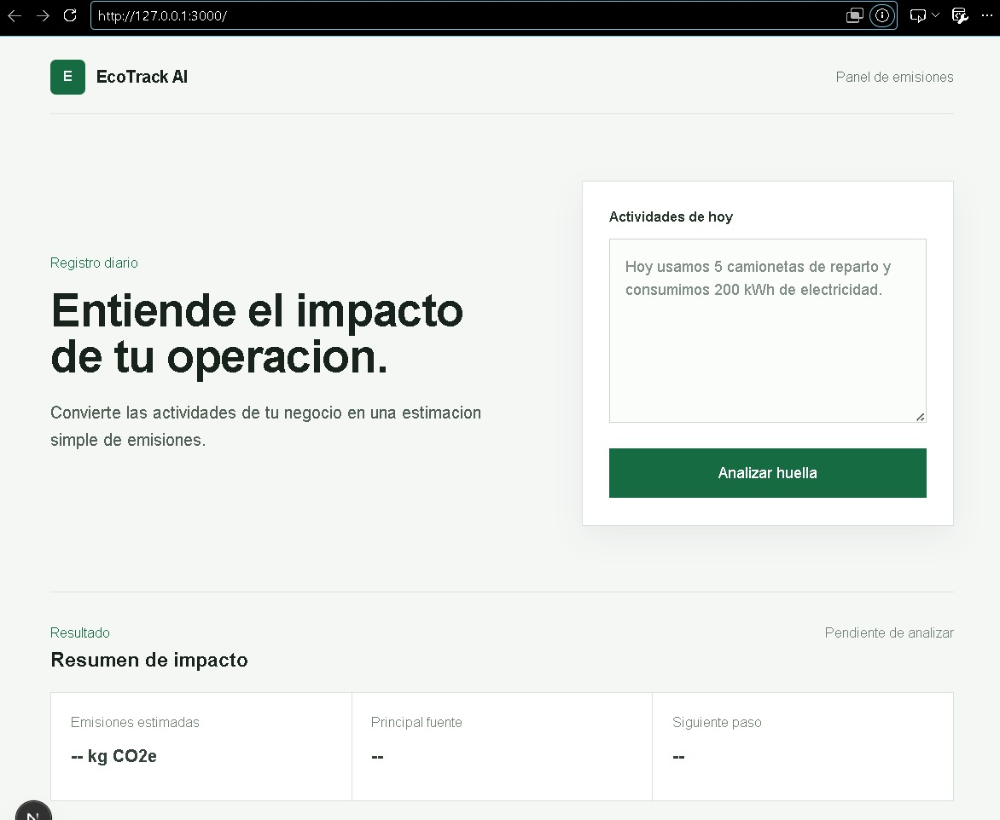
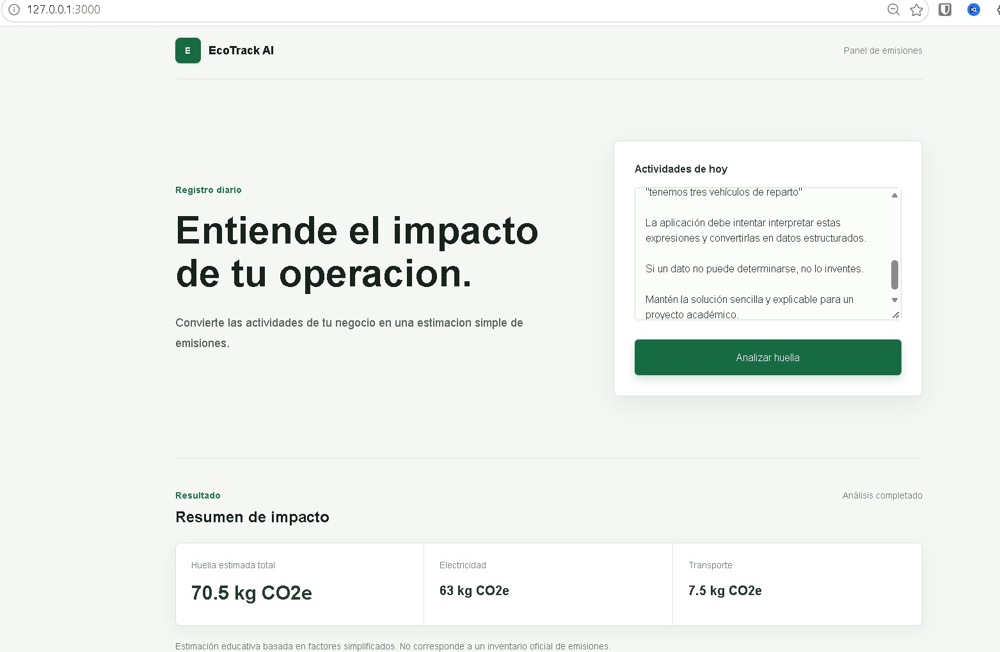
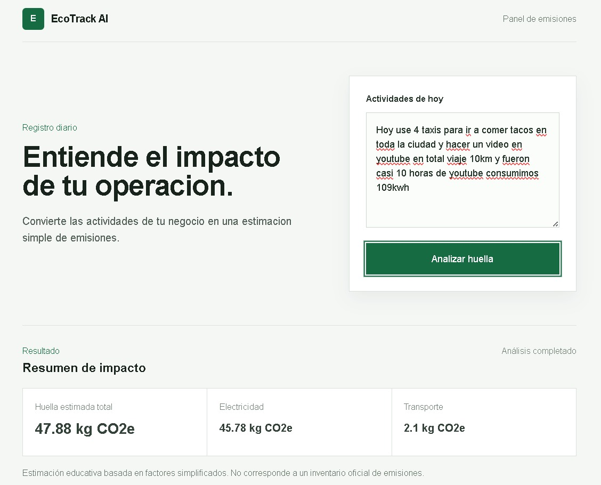
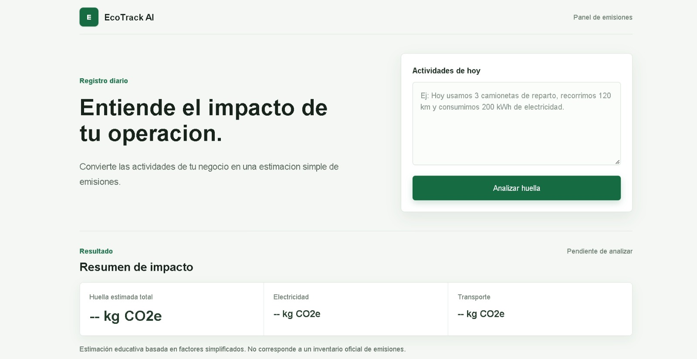

# Bitácora de desarrollo — EcoTrack AI

## 1. Objetivo

EcoTrack AI busca ayudar a pequeños negocios a registrar actividades diarias en lenguaje natural y obtener una estimación sencilla de emisiones de CO2e. El MVP responde a la dificultad de completar inventarios de emisiones cuando no se cuenta con tiempo o conocimiento técnico especializado.

## 2. Herramienta utilizada

Se utilizó Codex como asistente y agente de desarrollo para analizar el proyecto, proponer cambios, implementar funcionalidades y ejecutar verificaciones técnicas.

## 3. Master Prompt

El punto de partida fue construir un MVP académico llamado EcoTrack AI con Next.js, TypeScript y Tailwind CSS. Se definió una aplicación web para pequeños negocios, sin base de datos, autenticación, APIs externas ni librerías innecesarias. También se pidió una interfaz minimalista, profesional y relacionada con sostenibilidad, con tonos verdes, blanco y gris.

## 4. Desarrollo iterativo

- Se creó la estructura base de la aplicación web dentro de una carpeta independiente del proyecto existente.
- Se construyó la interfaz principal con un campo de actividades, un botón de análisis y un bloque de resultados.
- Se añadió extracción local de consumo eléctrico, vehículos, kilómetros y tipo de combustible mediante patrones definidos en código.
- Se incorporó una estimación educativa de emisiones con factores simulados y separados de la interfaz.
- Se conectó el formulario con la lógica para mostrar emisiones totales, electricidad y transporte.
- Se mejoró la presentación visual con tarjetas, espaciado, colores discretos y diseño responsive.
- Se ampliaron las expresiones reconocidas para aceptar acentos, números escritos comunes y distintas formas de indicar consumo y transporte.

## 5. Problema encontrado durante el desarrollo

La primera versión de la interfaz utilizaba demasiado espacio vertical. Después de realizar el análisis, los resultados quedaban fuera del primer viewport y el usuario tenía que desplazarse para encontrarlos.

Primero se pidió a Codex analizar la causa sin modificar código. El análisis identificó que el contenedor principal, el espacio vertical de la sección y la altura del formulario empujaban el bloque de resultados hacia abajo. Posteriormente se realizaron únicamente cambios de layout: se redujeron paddings, la altura del textarea y el espacio de las tarjetas, manteniendo intacta la lógica de extracción y cálculo.

## 6. Feedback Loop

El desarrollo se realizó en ciclos cortos. Cada cambio se implementó con un alcance limitado, se verificó con compilación, linter, comprobaciones de TypeScript o pruebas locales de la lógica, y luego se ajustó según el feedback recibido. Este ciclo permitió corregir detalles de interfaz, interpretación de números y validación de datos sin rehacer el proyecto.

## 7. Funcionalidad relacionada con IA

El MVP simula una experiencia de procesamiento de lenguaje natural. Interpreta distintas expresiones relacionadas con consumo de electricidad, vehículos y kilómetros, y las convierte en datos estructurados para generar una estimación. Esta interpretación se implementa localmente con normalización de texto y expresiones regulares; no utiliza un modelo externo ni una API de IA.

## 8. Limitaciones

- Los factores de emisión son aproximados y tienen fines demostrativos.
- La estimación no constituye un inventario oficial de gases de efecto invernadero.
- El reconocimiento de lenguaje natural es simplificado y depende de patrones definidos en el código.
- La aplicación no incluye persistencia de datos, autenticación ni integraciones externas.

## 9. Reflexión

Vibe Coding permitió pasar de una idea inicial a un MVP funcional trabajando principalmente mediante instrucciones en lenguaje natural. Codex ayudó a convertir esos pedidos en cambios concretos y verificables, mientras el desarrollador mantuvo el papel de validar resultados, limitar el alcance y dirigir las correcciones necesarias.

